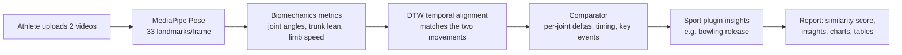

# PeakForm

Upload **two videos of the same athlete** (e.g. a bowler delivering at *124 kph* and at
*140 kph*), and PeakForm analyses both with pose estimation, **temporally aligns the two
movements**, and produces a **report explaining what changed in the body action** - so the
athlete can understand and repeat the better performance.

> Example output: *"At release your bowling-arm elbow was straighter by 22° (150° → 172°).
> A straighter arm at release typically transfers more energy into the ball."*

---

## How it works



1. **Pose extraction** - every frame is run through MediaPipe Pose to get 33 body landmarks.
2. **Metrics** - joint angles (elbow, shoulder, hip, knee), trunk lean and limb speed time-series.
3. **Alignment** - Dynamic Time Warping aligns the two clips so they're compared *phase-for-phase*, not just frame-for-frame (handles different tempo/length).
4. **Comparison** - per-joint mean/range differences, timing/tempo change, and a 0–100 movement-similarity score.
5. **Sport plugins** - pluggable analyzers add domain knowledge. The **bowling** plugin detects the release point (peak wrist speed) and explains pace-relevant differences (arm extension, front-knee brace, etc.).

---

## Tech stack

| Layer | Technology |
|-------|-----------|
| API | FastAPI (Python 3.11) |
| Computer vision | MediaPipe Pose, OpenCV, NumPy |
| Comparison | Custom multivariate DTW + biomechanics |
| Database | SQLAlchemy 2.0 - SQLite (dev) / PostgreSQL (prod) |
| Async processing | FastAPI background tasks (Celery/Redis-ready) |
| Auth | JWT (python-jose) + bcrypt |
| Frontend | Next.js 14, TypeScript, Tailwind CSS, Recharts |
| Infra | Docker + Docker Compose |

---

## Project structure

```
.
├── backend/
│   ├── app/
│   │   ├── analysis/        # CV engine: pose, metrics, alignment, comparator
│   │   │   └── sports/      # per-sport analyzer plugins (generic, bowling)
│   │   ├── api/routes/      # auth, sports, videos, comparisons
│   │   ├── core/            # config, database, security
│   │   ├── models/          # SQLAlchemy models
│   │   ├── schemas/         # Pydantic schemas
│   │   ├── tasks.py         # background processing
│   │   └── main.py          # FastAPI app
│   └── requirements.txt
├── frontend/
│   ├── app/                 # Next.js App Router pages
│   ├── components/          # UI + charts + report
│   └── lib/                 # API client, auth, types
└── docker-compose.yml
```

---

## How to run PeakForm

You need **two terminals** for local development: one for the backend API, one for the frontend UI.

| Service | URL |
|---------|-----|
| Frontend (app) | http://localhost:3000 |
| Backend API docs | http://localhost:5678/docs |
| Backend health check | http://localhost:5678/health |

### Prerequisites

- **Python 3.11+**
- **Node.js 18+** and npm
- (Optional) **Docker** if you prefer running everything in containers

---

### Option A — Local development (recommended)

#### First-time setup

**Backend** (terminal 1):

```bash
cd backend
python -m venv .venv
.venv\Scripts\activate          # Windows
# source .venv/bin/activate     # macOS / Linux
pip install -r requirements.txt
copy .env.example .env          # cp on macOS/Linux — only needed once
```

**Frontend** (terminal 2):

```bash
cd frontend
npm install
copy .env.local.example .env.local   # cp on macOS/Linux — only needed once
```

#### Start the backend (terminal 1)

```bash
cd backend
.venv\Scripts\activate          # Windows
# source .venv/bin/activate     # macOS / Linux
uvicorn app.main:app --reload --port 5678
```

Leave this running. You should see `Uvicorn running on http://127.0.0.1:5678`.

#### Start the frontend (terminal 2)

```bash
cd frontend
npm run dev
```

Leave this running. You should see `Ready` and `http://localhost:3000`.

Open **http://localhost:3000** in your browser.

> **No account yet?** Go to **http://localhost:3000/try** to run one free comparison without signing up.

#### Daily use (after first setup)

You only need the two start commands above — no need to reinstall unless dependencies change.

---

### Option B — Docker (both services at once)

From the project root:

```bash
docker compose up --build
```

- Frontend: http://localhost:3000
- API docs: http://localhost:5678/docs

Stop with `Ctrl+C`, or run `docker compose down`.

---

### Troubleshooting

| Problem | Fix |
|---------|-----|
| Frontend can't reach API | Ensure the backend is running on port **5678**. Check `frontend/.env.local` has `NEXT_PUBLIC_API_BASE=http://localhost:5678`. |
| `Module not found` (Python) | Activate the venv (`.venv\Scripts\activate`) and run `pip install -r requirements.txt` again. |
| Port already in use | Stop the other process on 3000 or 5678, or change the port in the start command. |
| Stale Next.js build errors | Stop the dev server, delete `frontend/.next`, then run `npm run dev` again. |

---

## Using it

1. Register an account.
2. Upload two videos **of the same sport** (pick *Cricket Bowling* for the bowling plugin).
   Add an optional metric (e.g. `124`, unit `kph`) so the report ties movement to outcome.
3. Wait for both to finish analysing (status turns **completed**).
4. Create a comparison (baseline = before, target = after).
5. Open the comparison to see the similarity score, coaching insights, joint-by-joint table and angle charts.

> **Tip:** film from a consistent side-on angle with the whole body in frame for the best pose tracking.

---

## Scaling to production (roadmap)

The architecture is deliberately built to grow:

- **Database**: set `DATABASE_URL=postgresql+psycopg://…` and add `psycopg[binary]` to requirements. Models are already Postgres-compatible. Add Alembic for migrations.
- **Async workers**: `tasks.py` functions take only ids and own their DB session - move them to Celery/RQ + Redis with no call-site changes.
- **Storage**: `services/storage.py` is an abstraction layer - swap local disk for S3/GCS.
- **More sports**: add a class in `app/analysis/sports/`, register it in `registry.py`, and seed a `Sport` row pointing at its `analyzer_key`.
- **GPU / accuracy**: swap the pose backend (e.g. higher-complexity model or a dedicated pose service) behind `analysis/pose.py`.
- **Future**: multi-video progress tracking, automatic speed estimation from video, skeleton overlay video export, coach/athlete roles and sharing.
